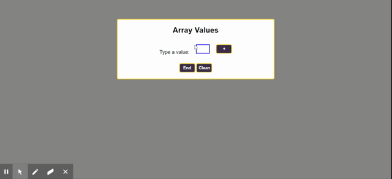

# Plus Minus (Mais Menos)

> Aplicação feita para verificar a porcentagem de números positivos, negativos e nulos dentro de um array.
> Desafio do [HackerRank](https://www.hackerrank.com/challenges/plus-minus/problem) com algumas mudanças.

## Author 
:woman_technologist: **ViviRamos**

[*LinkedIn*](https://linkedin.com/in/viviane-ramos-luz-346169187)